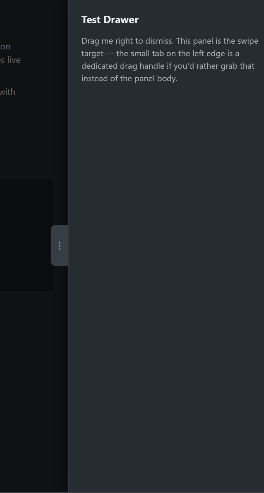

# Drawer Handle

## Bruce's Ask

The basic [demo of swipe dismiss](../demo/swipe-dismiss-test.html) has a handle on the edge of the drawer:

Is it possible to add such a feature (optionally) to side-burger element?

If so, please implement and add implementation notes.  If further clarifications are needed first, please add those below before implementing.

---

## Claude's Implementation Notes

Yes — and most of the pieces were already there. `root.html` has always shipped a
`.drag-handle` element (with `part="drag-handle"`), it was just hidden, wrongly
positioned (on the *outer* edge, off-screen), and never gated behind anything.
Wired it up as an opt-in affordance.

### Design

- **Opt-in via a boolean `drag-handle` attribute.** Off by default; the drawer
  looks exactly as before.
- **No new gesture code.** The swipe feature's `handle` is already the whole
  `#drawer`, and the tab is a child of the drawer, so a `pointerdown` on the tab
  already bubbles to the same listener. The tab is purely a *visual cue* on top
  of the existing "drag the drawer body" gesture — same as the reference demo,
  where both the panel and the tab work.
- **Presentation only, so it's CSS-only.** `:host([drag-handle])` matches the
  host attribute directly from the shadow stylesheet — no merge, no JS. It is
  wired into `withAttrs` solely so a `dragHandle` **property** mirrors the
  attribute, matching `open` / `disabled`.
- **Not keyboard-accessible on purpose.** The tab stays `aria-hidden="true"` and
  non-focusable; it's a supplementary pointer affordance. Escape, the close
  button and the scrim remain the accessible ways to dismiss. Also **drag-only**
  — a plain click/tap on the tab does nothing (the 8px slop from the
  close-button fix gives this for free).

### Changes

**`root.html`** — rewrote the `.drag-handle` rules:
- `display:none` by default; `:host([drag-handle]) .drag-handle { display:block }`.
- Moved to the drawer's **inner** edge (`right:-16px`, mirrored to `left:-16px`
  for `position="right"`) so it actually sits on-screen, protruding into the
  page over the scrim.
- Restyled as a rounded surface-coloured tab with a grip bar (`::after`), a soft
  shadow, and `cursor: grab`/`grabbing`. `touch-action:none` kept. It rides
  along with the drawer during the drag because it's a child of `#drawer`
  (which is what gets the inline `translateX`).

**`el-maker.mjs`** → regenerated **`el-maker.json`**:
- `dragHandle` added to `props`, and to `withAttrs` as
  `drag-handle` ⇄ `dragHandle` (`Boolean`, `sourceOfTruth`). No merge.

**`types.d.ts`**:
- `dragHandle: boolean` on `EndUserProps` (with the "presentation only /
  supplementary" caveat); `dragHandle` added to `cssParts`.

**`README.md`** — new "Swipe to dismiss" section documenting the gesture and the
`drag-handle` attribute.

**`demo/dev.html`** — added `drag-handle` to the `<side-burger>` so the tab is
visible in the dev demo (remove it to see the default).

### Verification (headless Chromium, `spa-ssi` serve)

| check | result |
|---|---|
| `drag-handle` set → tab visible, on-screen (`x≈279, 17×58`, on the drawer's inner edge) | ✓ |
| no `drag-handle` attribute → tab `display:none` | ✓ |
| drag the tab ~220px toward the edge → drawer dismisses (`open`→`false`, `#drawer.inert`→`true`) | ✓ |
| plain click on the tab (no movement) → drawer stays open | ✓ |
| console | clean | 

Temp test files removed; working tree holds only `root.html`, `el-maker.mjs`,
`el-maker.json`, `types.d.ts`, `README.md`, `demo/dev.html`, and this chat.

### Not done (say the word)

- `::part(drag-handle)` is exposed, but there's no CSS custom property for its
  size/offset — restyle via `::part` for now.
- Right-side placement is implemented but only left was exercised in the
  automated run; worth an eyeball with `position="right"`.
- No click-to-close on the tab (kept drag-only to match the reference). Easy to
  add if you want tap-the-tab-to-close.